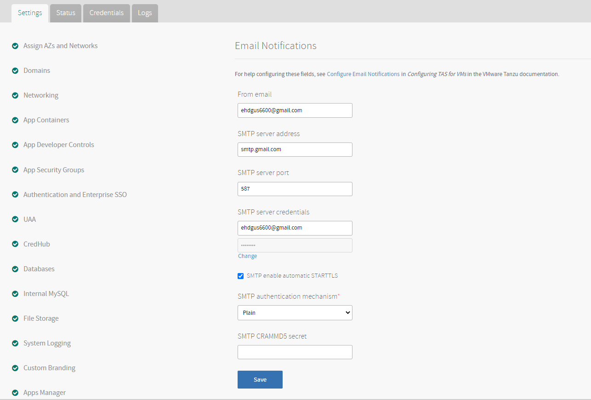
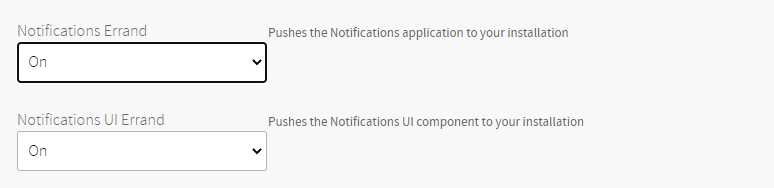
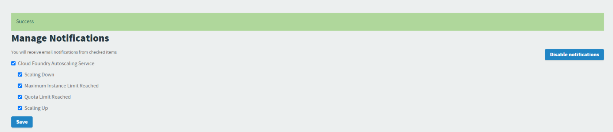
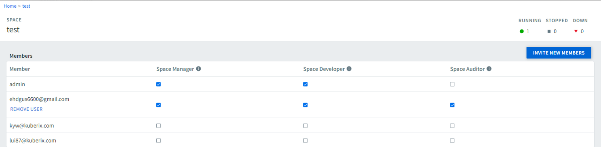
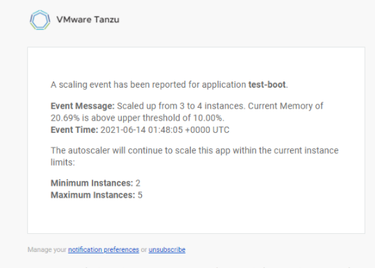
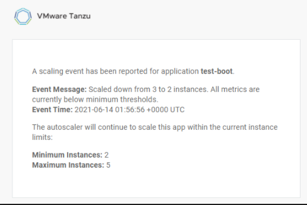
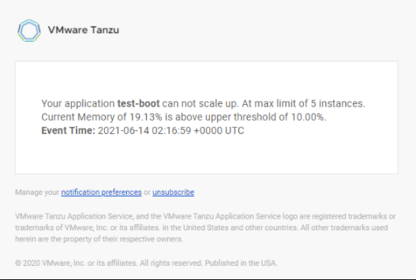

# TAS Tile Notifications - SMTP 연동 가이드
- 본 문서는 TAS 내부 Notifications 설정을 활성화하여 특정 측정 대상의 Alert를 SMTP Server를 통해 수신하는 방법에 대한 가이드입니다.
- 주요 측정 대상은 아래와 같습니다.
	- Scaling Down
	- Maximum Instance Limit Reached
	- Quota Limit Reached
	- Scaling Up
	- User Invite
- 사전 조건으로는 587, 465, 22 등 SMTP가 사용하는 방화벽을 Open 해야 할 수 있습니다.
- Gmail 연동 시에는 

## 1. TAS  설정 및 Apply Change 실행

### 1.1. TAS Notifications 설정   
- Ops Manager UI -> TAS Tile -> Email Notifications 설정

### 1.2. TAS Errand 설정
- Ops Manager UI -> TAS Tile -> Email Errands 설정, Notifications Errand, Notifications UI Errand가 On 상태 인지 확인합니다.

## 2. Notifications 정보 확인 및 사용자 권한 설정

### 2.1. notifications UI 확인
- Apply Change가 완료 되면 아래 링크에 접속하여 Save 버튼을 클릭 합니다.
	- https://notifications-ui.{SYSTEM_DOMAIN}/preferences

### 2.2. Apps Manager UI 확인
- Apps Manager에 접근하여 메일 수신 대상의 사용자를 특정 Space에서 Invite 또는 Space Developer 권한으로 변경합니다.

## 3. Autoscale에 대한 Notifications 확인

- Scale Up이 발생 하였을 경우

- Scale Up이 발생 하였을 경우

- Scale Limit이 발생 하였을 경우

