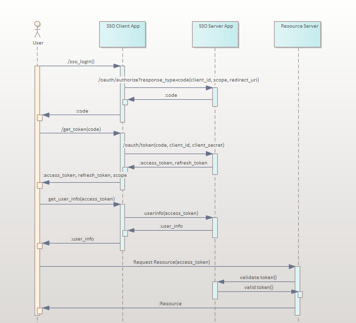

# TAS UAA - OAuth2 통신
- UAA는 Cloud Foundry에서 사용되는 Multi Tenant ID 관리 서비스이지만 독립형 OAuth2 Service를 지원합니다. UAA를 통해 별도의 Login Service를 구성할 수 있으며 OAuth2 기반을 사용하여 Kibana, Grafana, CA Site Minder, Active Directory 등 다양한 Third Party의 에코 시스템과 연동 할 수 있습니다.
- 해당 장에서는 UAA의 OAuth2에 대해서 다루며 종류는 아래와 같으며 특히 Authorization Code Grant Type에 대해 작성합니다.
	- Authorization Code Grant Type : 권한 부여 코드 승인 타입
	- Implicit Grant Type : ID/PWD 승인 타입
	- Resource Owner Password Credentials Grant Type : 리소스 소유자 암호 자격 증명 타입
	- Client Credentials Grant Type : 클라이언트 자격 증명 타입


## 1. OAuth2

- TAS SSO는 Opensource UAA OAuth2 통신의 기반으로 아래와 같은 요청 형태를 가지고 있으며, Google, Naver, Youtube에도 동일한 거의 방식으로 OAuth2 방식의 통합 로그인을 사용 할 수 있습니다.
	1) OAuth2 Login 유무 확인
		- 로그인이 되어 있을 경우: Endpoint에 설정한 Page로 Redirect
		- 로그인이 안되어 있을 경우: Login Page로 Redirect
		- 요청 성공 시 Code 값 반환, 이때 Code 값은 Token을 가져오는데 반드시 필요한 값입니다.
	2) OAuth2 Access Token을 통한 권한 확인
		- Access Token을 통해 요청한 인증 서명서가 올바른지, OAuth2에충분한 권한(scim, uaa_attribute 등)을 갖고 있는지 확인 합니다. 
	3) OAuth2 Access Token을 통한 사용자 계정 확인
	    - Endpoint를 통한 User 정보를 Get하여 Spring Security 등으로 권한의 Role을 Check 합니다.
	4) 만료 된 OAuth2 Access Token를 Refresh
		    - Access Token의 기본 사용 시간은 12시간(43200s)으로 12시간이 지나기전에 Refresh를 하여 신규 발급이 필요합니다.
	5) Logout
		    - Logout 시 설정한 Redirect 페이지로 이동 합니다, 설정하지 않으면 자동으로 Login Page로 이동됩니다.




## 2. 운영 간 특이 사항
- 운영 간의 SSO OAuth2에서 많이 발생하였던 에러에 대해 설명합니다.
- 거의 대부분의 Error는 브라우저의 Console 또는 Network의 Response 창, CURL 결과 값으로 출력 됩니다.
- Header 값에 맞지 않는 다른 Header가 들어가게 되면 요청 간 401 Http Status Error가 발생합니다.

### 2.1. Code 값 확인
-  OAuth2 Endpoint 중 /authorize에 대한 에러 입니다. authorize 결과로 code를 가져오게 되는데 해당 code 값을 통해 access token을 발급 할 수 있습니다.
- 사용 예시

```
https://{SSO_LOGIN_DOMAIN}/oauth/authorize?response_type=code&client_id=${CLIENT_ID}&scope=openid&redirect_uri=${REDIRECT_URL}
```

- 이때 많이 발생하는 에러는 다음과 같습니다.
	1) 주체의 SSO Service{sso.login.xxx.xxx.xx}에서 올바른 client_id를 가져왔는지?
		- Console에 "Bad Credential" 또는 "Miss Match Rediect URL"이 표시 됩니다. 
	2) redirect_uri이 SSO Developer Dashboard에 표시 및 설정 되는지?
		- Console에 "Miss Match Rediect URL" 또는 Redirect URL이 없다고 표시 됩니다.
	3) WEB 방식으로 호출을 받는지?
		- CURL 또는 소스코드에서 Rest API 방식으로 요청을 보내게 되면 Code 값이 Return 되지 않습니다.

### 2.2. Token 값 확인
- OAuth2 Endpoint 중 /token에 대한 에러 입니다.
- 해당 endpoint를 code 값을 post 방식으로 보내 Access Token을 발급 받습니다. Access Token은 JWT 방식으로 user에 대한 정보, Role, 인증 기관, 만료 기간 등의 정보를 갖고 있습니다. JWT 방식의 Access Token 결과 값은은 아래의 링크에서 확인이 가능합니다. 간혹 다른 데이터가 넘어 오는지 바로 확인 할 수 있습니다.
- [JWT](https://jwt.io/)


```
https://{SSO_LOGIN_DOMAIN}/oauth/token
```

- 이때 많이 발생하는 에러는 다음과 같습니다.
	1) Header에 사용 될 Code 값에 대한 시간 초과와 이미 사용되었는지?
		- Code 값은 짧은 Time과 1회성으로 발급 되는 값입니다. 만약 일정 시간이 지난 후 사용되거나 2회 이상 사용 되었을 경우 Code 값이 잘못 되었다는 오류가 발생합니다.
	2) 발급 받은 Code에 대한 Rediect URL을 매칭시켰는지?
		- Access Token을 가져올때 사용된 Code 값을 받아오는 authorize의 redirect_uri와 Access Token의 redirect_uri이 다르면 "Miss Match Rediect URL" 에러가 출력 됩니다.

### 2.3. User Info 값 확인
- User Info 값은 Access Token을 바탕으로 /userinfo endpoint을 호출하여 현재 사용자의 정보를 확인 할 수 있습니다.
- 사용 예시

```
https://{SSO_LOGIN_DOMAIN}/userinfo
```

- 이때 많이 발생하는 에러는 다음과 같습니다.
	1) Access Token의 기간 만료가 되기전 Refresh를 하였는지?
		- Access Token은 43200s(12시간)의 만료 시간을 갖고 있습니다. 만약 이 Token을 Refresh해주지 않으면 "Expired Token" 만료된 Token이라는 에러 메세지가 출력 됩니다.


## 3. 간단한 CURL을 통한 기능 검증 방법

- 현재 일부의 Endpoint 기능 검증은 CA 쪽에서 자동으로 Redirect를 강제적으로 Login 페이지로 보내 현재는 확인이 불가능 합니다.

### 3.1. authorize 예시

```
https://{SSO_LOGIN_DOMAIN}/oauth/authorize?client_id={REDIRECT_URL}&response_type=token&redirect_uri=${REDIRECT_URL}
```

### 3.2. token 예시
-  Portal Login  후 Code 값을 받으면 해당 Code 값을 바탕으로 Access Token 요청을 합니다.

- Code 값 예시
```
https://www.naver.com/?code=YdEtPbMcD8
```

- Token Endpoint

```
 curl --request POST \
   --url 'https://sso.login.{DONMAIN}/oauth/token' \
   --header 'content-type: application/x-www-form-urlencoded' \
   --data grant_type=authorization_code \
   --data 'client_id=${CLIENT_ID}' \
   --data client_secret=${CLIENT_SECRET} \
   --data code=${CODE}\
   --data 'redirect_uri=${REDIRECT_URL}'
```

### 3.3 user info 예시 - user에 대한 정보가 출력 됩니다.

```
 curl -v -X POST \
 -H "Authorization: Bearer $ACCESS_TOKEN" \
 "https://sso.login.{DOMAIN}/userinfo"
```


