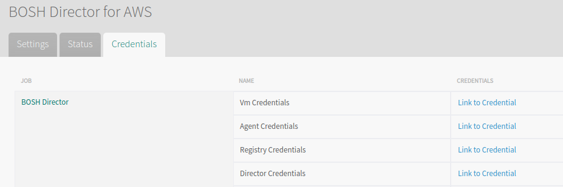
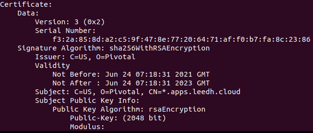
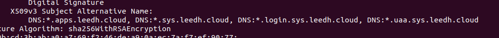

# TAS 내부 Networking SSL 인증서 정보 확인 (Credhub)
- 초기 TAS 구축 History의 누락으로 인하여 인증서 변경에 필요한 Cert 파일에 대한 Alternative DNS 정보가 누락되어 신규 생성 시 어떠한 정보가 필요한지 모름, 잘 못 생성 하게 된다면 업무 App에서 509 Cert 에러가 발생 할 가능성이 있음.
- LB 정보와 실제 Cert 정보 비교가 필요하여 Credhub에 저장되어 있는 인증서를 Openssl을 통하여 확인


## 1. TAS 내부 Networking SSL 인증서 정보 확인

### 1.1. Credhub 권한 정보 획득

- 작업은 Ops Manager에 SSH 하여 진행, 10.0.2.11는 Bosh IP, 버전에 따라 credhub cli가 opsmanager에 없을 수도 있습니다.

```
$ credhub api -s  [https://10.0.2.11:8844](https://10.0.2.11:8844/)  --ca-cert /var/tempest/workspaces/default/root_ca_certificate  
Setting the target url:  [https://10.0.2.11:8844](https://10.0.2.11:8844/)  
  
$ credhub login  
username: director  
password: ********************************  
Login Successful
```

-  위 인증정보는 bosh tile의 director credential을 사용하였습니다.



### 1.2. Credhub 명령을 통하여 인증서 파일 Get

```
$ credhub find | grep ssl  
- name: /opsmgr/p-isolation-segment-b0b23a14da895c67977e/networking_poe_ssl_certs/0/certificate **## 1대의 ISG 영역 Networking Config 인증서 KB의 경우 ISG가 여러대가 존재 할 것입니다.**  
- name: /opsmgr/cf-cf6ad23a7cf45ce81140/uaa/ssl_credentials  **## TAS 영역의 UAA Config 인증서**  
- name: /opsmgr/cf-cf6ad23a7cf45ce81140/networking_poe_ssl_certs/0/certificat **## TAS 영역의 Networking Config 인증서**  

$ printf -- "$(credhub get -n /opsmgr/cf-cf6ad23a7cf45ce81140/uaa/ssl_credentials -j | jq .value.cert_pem)" | tr -d '"' > uaassl.crt
$ printf -- "$(credhub get -n /opsmgr/cf-cf6ad23a7cf45ce81140/networking_poe_ssl_certs/0/certificate -j | jq .value.cert_pem)" | tr -d '"' > networkssl.crt
$ printf -- "$(credhub get -n /opsmgr/p-isolation-segment-b0b23a14da895c67977e/networking_poe_ssl_certs/0/certificate -j | jq .value.cert_pem)" | tr -d '"' > isgnetworkssl.crt  
```

### 1.3. Openssl 명령을 통하여 인증서 파일 정보를 확인

$ openssl x509 -noout -text -in uaassl.crt  
$ openssl x509 -noout -text -in networkssl.crt  
$ openssl x509 -noout -text -in isgnetworkssl.crt  





